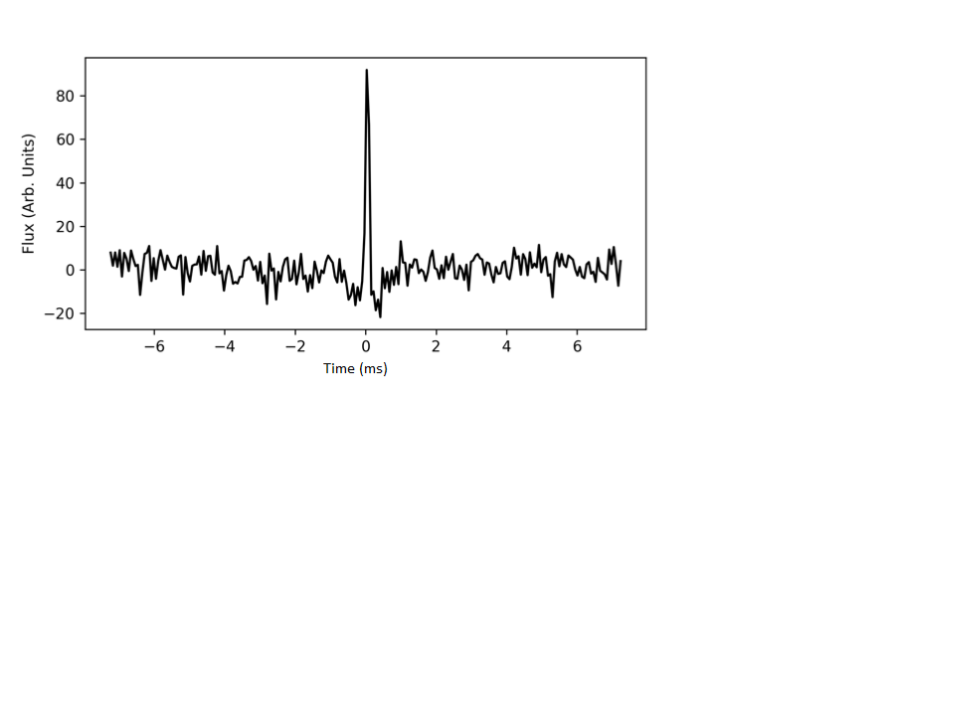
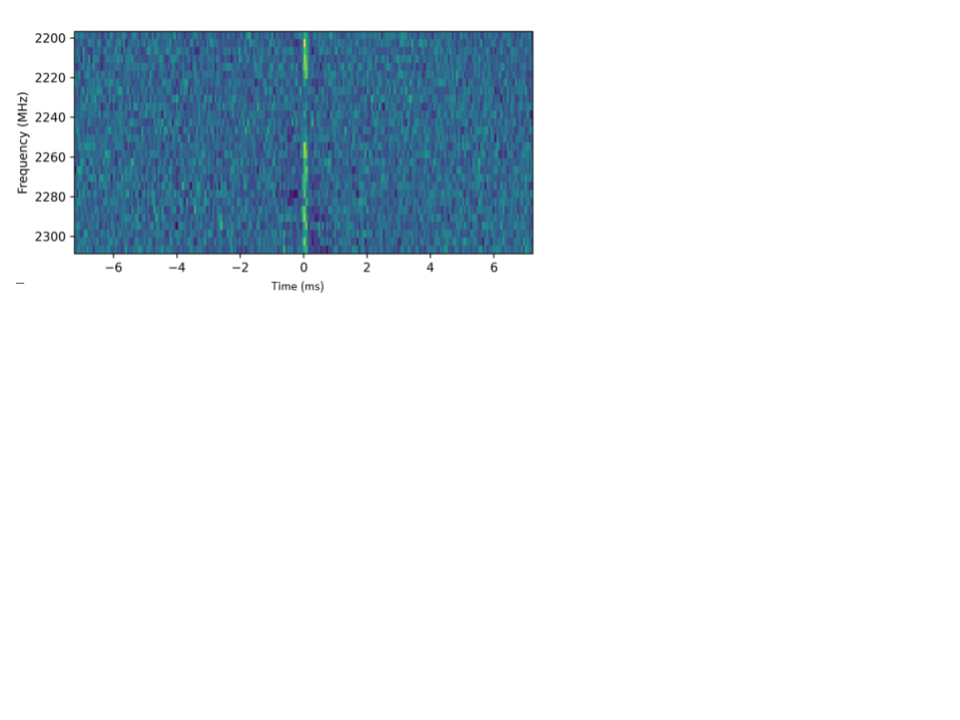
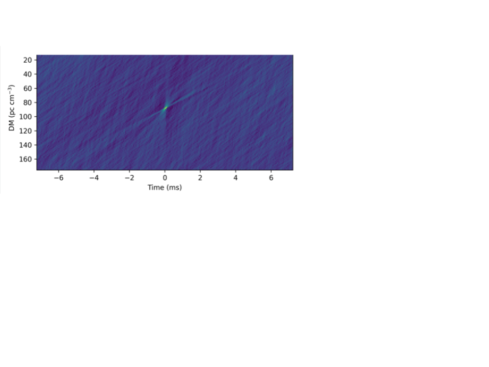

# Fast Radio Burst (FRB) Detection and Data Processing Pipeline

Fast radio bursts are brief, energized radio pulses from an unknown astronomical origin. Due to observations of radio pulsations, magnetars have been theorized to generate fast radio bursts. Measuring the time delay between the radio and optical wavelengths produced could explain the mechanism behind fast radio burst production in magnetars. We construct a pipeline to process, detect, and display radio pulses in a real-time manner. Upon detection, a signal will be sent to trigger data collection on the optical side, and the potential pulse will be displayed  on a web server. The pipeline has been optimized to process data at a rate much quicker than the collection period.  Our pipeline will be deployed to the newly constructed DSS-14 radio telescope at the Goldstone Observatory.

## Overview

The pipeline consists of several processing stages: 

1. Conversion of raw data to workable filterbank files
2. Preprocessing steps to clean up interference and prepare the data for pulse searching
3. Dedispersion and pulse search
4. Database Display

### Data Conversion

We convert the raw data files into workable filterbank files using the DSS-14 unpacking script mkfb.

### Preprocessing

With a workable file format, we employ a series of preprocessing steps to clean up interference and prepare the data for pulse searching. These steps are conducted using memory mapping, which allows the direct access of files by mapping file data to address space. This technique minimizes read and write file operations, improving the speed of preprocessing operations significantly.

The processing steps include:

- Radio-frequency interference (RFI) mitigation
- Bandpass filtering
- Further RFI mitigation for narrow band masking
- Data standardization

The memory mapping yields a significant 75% time improvement, allowing the preprocessing time to run well under the data collection time.

### Dedispersion and Pulse Search

The incoming radio radiation from a pulsar undergoes dispersion as it travels through the interstellar medium, resulting in a smearing effect in the unprocessed data. We account for this effect and de-disperse the data with a given dispersion measure (DM).

We use Presto, a pulse analysis package, to dedisperse the output file created after the memory mapping steps and run a single pulse search script. This script outputs a file with all potential pulse candidates and their corresponding signal-to-noise ratio (SNR) values, indicating the strength of a burst.

### Database Display

We employ the data plotting package Your to visualize the pulse candidates, generating three plots for each candidate along with other relevant statistics.

We use Apache to create a local web server, with Django as the web framework, to display the pipeline results in real-time. As each chunk finishes processing, the web server displays the chunk ID, time, and a link for detailed statistics. If there are any pulse candidates, the statistics link displays a page with previews for each candidate of the corresponding chunk.

## Usage
The pipeline consists of three main scripts: 

- `data_reduce_params_bb.py`: This is the parameters file. Set the `indirectory` and `outdirectory` here.
- `frb_detect.py`: This is the main script that drives the pipeline.
- `sp_cand_plots.py`: This is the plotting script used for visualizing the pulse candidates.

## Figures

Flux vs. Time plot of a FRB candidate from M81 pulsar generated with your plotting software

Frequency vs. Time plot

Dispersion Measure (DM) vs. Time plot

